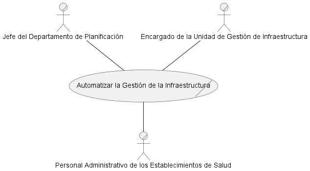
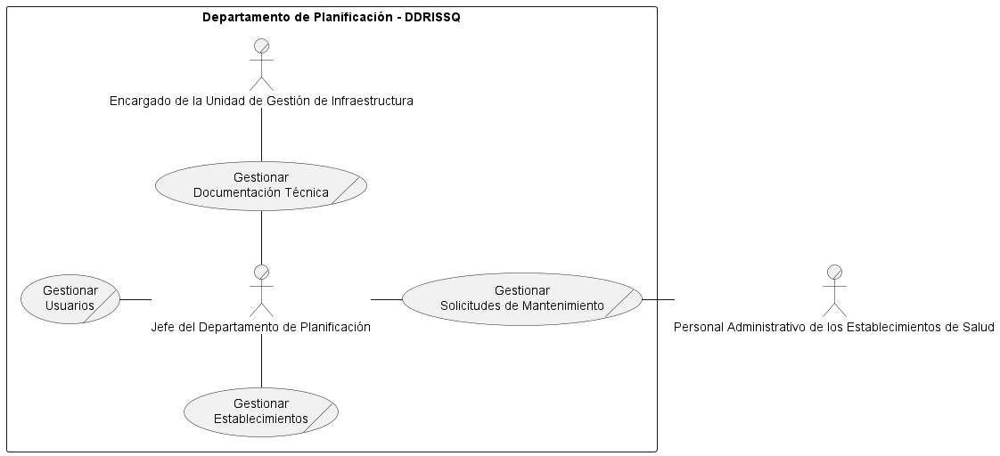
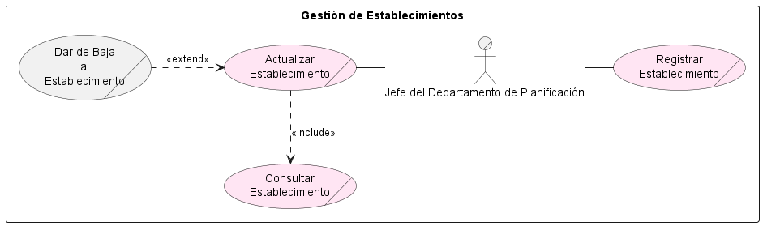
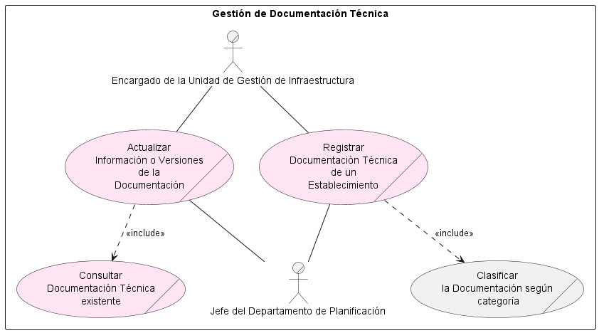
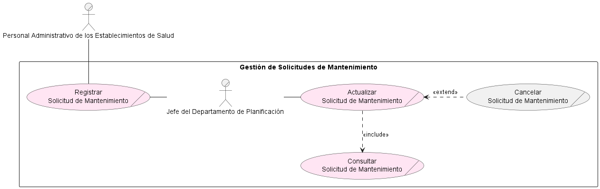
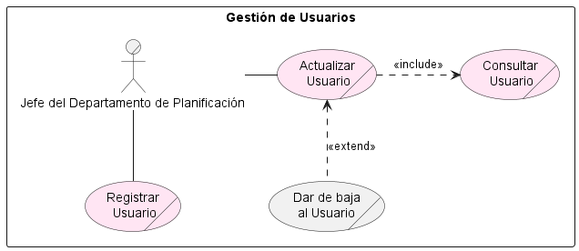
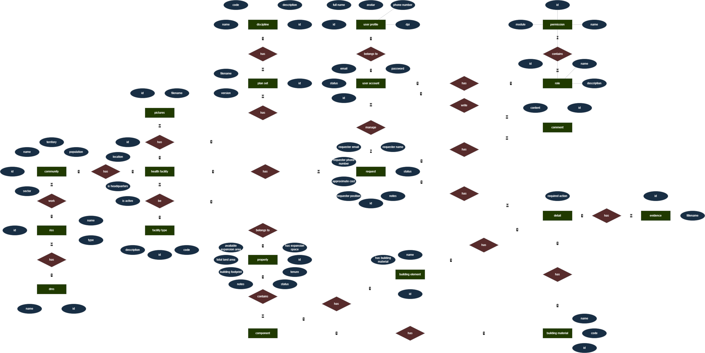
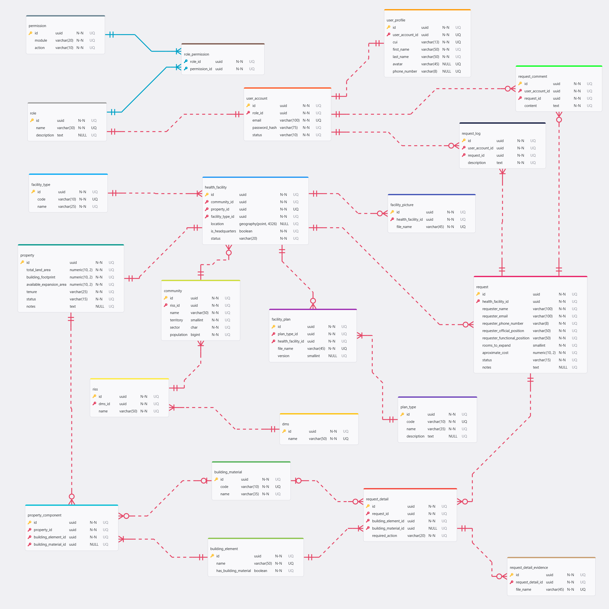

# SIGDOSI-DDRISSQ-DOCS

## Tabla de Contenido
1. [Core del Negocio](#1-core-del-negocio)
2. [Casos de Uso Expandidos](#2-casos-de-uso-expandidos)
3. [Drivers Arquitectonicos](#3-drivers-arquitectonicos)
4. [Matrices de Trazabilidad](#4-matrices-de-trazabilidad)
5. [Historias de Usuario](#5-historias-de-usuario)
6. [Diseño de Bases de Datos](#6-diseño-de-base-de-datos)
7. [Arquitectura del Sistema](#7-arquitectura-del-sistema)

## 1. Core del Negocio

### Descripción 
La Dirección Departamental de Redes Integradas de Servicios de Salud de Quezaltenango (DDRISSQ) es la institución encargada de garantizar y coordinar los servicios médicos, programas de prevención y trámites sanitarios en todo el departamento. Dentro de esta estructura, el Departamento de Planificación para la Salud tiene entre sus funciones planificar, coordinar y dar seguimiento a las acciones relacionadas con la infraestructura de los establecimientos adscritos a la DDRISSQ, mediante la gestión de documentación técnica y el control de solicitudes de mantenimiento.

### Stakeholders
* **Jefe del Departamento de Planificación**: Supervisa la gestión de documentación técnica y solicitudes de mantenimiento, dando seguimiento a los procesos y apoyando la toma de decisiones relacionadas con la infraestructura.
* **Encargado de la Unidad de Gestión de Infraestructura**: Gestiona la documentación técnica, administra solicitudes de mantenimiento y da seguimiento al estado de la infraestructura de los establecimientos.
* **Personal Administrativo de los Establecimientos de Salud**: Interesados en el seguimiento y resolución de necesidades de infraestructura del establecimiento; reciben los beneficios de la gestión realizada.

### Diagrama CDU de Alto Nivel



### Primera Descomposición



## 2. Casos de Uso Expandidos

### CDU100 - Gestionar Establecimientos



|**Id**|CDU100|
|-|-|
|**Nombre**|Gestionar Establecimientos|
|**Actores**|Jefe del Departamento de Planificación|
|**Proposito**|Mantener disponible y actualizada la información de los establecimientos de salud adscritos a la DDRISSQ para apoyar los procesos de planificación relacionados con infraestructura.|
|**Resumen**|Permite administrar y mantener actualizada la información general y de ubicación de los establecimientos de salud, facilitando su identificación, seguimiento y vinculación con los procesos de documentación técnica y mantenimiento de infraestructura.|
|**Ruta Esperada**|1. Registro de un establecimiento de salud.<br>2. Actualizar información relevante del establecimiento.<br>3. Mantener el estado de vigencia del establecimiento.<br>4. Consultar información de establecimientos según necesidades operativas.<br>5. Asociar o mantener actualizada la ubicación geográfica del establecimiento.|
|**Cursos Alternos**|1a. La información del establecimiento ya existe y se procede únicamente a su actualización.<br>2a. El establecimiento se da de baja.<br>4a. No se encuentran establecimientos que cumplan con los criterios de consulta.|
|**Prioridad**|Alta.|

### CDU200 - Gestionar Documentación Técnica



|**Id**|CDU200|
|-|-|
|**Nombre**|Gestionar Documentación Técnica|
|**Actores**|Encargado de la Unidad de Gestión de Infraestructura<br>Jefe del Departamento de Planificación|
|**Proposito**|Mantener disponible y actualizada la documentación técnica sobre la infraestructura de los establecimientos de salud adscritos a la DDRISSQ para apoyar los procesos de toma de decisiones relacionadas con infraestructura.|
|**Resumen**|Permite administrar y mantener actualizada la documentación técnica de los establecimientos de salud, facilitando su seguimiento y vinculación con los procesos de mantenimiento de infraestructura.|
|**Ruta Esperada**|1. Registrar documentación técnica de un establecimiento de salud.<br>2. Actualizar la información o los archivos asociados a la documentación técnica.<br>3. Consultar documentación técnica según las necesidades operativas.<br>4. Mantener el estado de vigencia de la documentación técnica.|
|**Cursos Alternos**|1a. El establecimiento de salud asociado no existe o no se encuentra disponible.<br>3a. No se encuentra documentación técnica que cumpla con los criterios de consulta.|
|**Prioridad**|Alta.|

### CDU300 - Gestionar Solicitudes de Mantenimiento



|**Id**|CDU300|
|-|-|
|**Nombre**|Gestionar Solicitudes de Mantenimiento|
|**Actores**|Jefe del Departamento de Planificación|
|**Proposito**|Permitir el registro, seguimiento y actualización de las solicitudes de mantenimiento de la infraestructura de los establecimientos de salud adscritos a la DDRISSQ, apoyando la planificación y control de las intervenciones de mantenimiento.|
|**Resumen**|Permite administrar las solicitudes de mantenimiento, facilitando su registro, consulta, actualización y seguimiento mediante el control de su estado y demás información relevante.|
|**Ruta Esperada**|1. Registrar una solicitud de mantenimiento para un establecimiento de salud.<br>2. Actualizar la información de la solicitud.<br>3. Consultar solicitudes de mantenimiento según las necesidades operativas.<br>4. Dar seguimiento al estado de la solicitud (Pendiente, En proceso, Finalizada o Cancelada).<br>5. Registrar observaciones o información complementaria relacionada con la atención de la solicitud.|
|**Cursos Alternos**|1a. El establecimiento de salud asociado no existe o no se encuentra disponible.<br> 2a. La solicitud de mantenimiento que se desea actualizar no existe en el sistema.<br> 2b. La solicitud de mantenimiento es cancelada.<br>3a. No se encuentran solicitudes de mantenimiento que cumplan con los criterios de consulta.<br>4a. La solicitud ya se encuentra finalizada o cancelada y no permite determinadas modificaciones.|
|**Prioridad**|Alta.|

### CDU400 - Gestionar Usuarios



|**Id**|CDU400|
|-|-|
|**Nombre**|Gestionar Usuarios|
|**Actores**|Jefe del Departamento de Planificación|
|**Proposito**|Permitir la administración de los usuarios del sistema mediante su registro, consulta, actualización y control de acceso, garantizando que únicamente el personal autorizado pueda utilizar las funcionalidades del sistema de acuerdo con su rol.|
|**Resumen**|Permite administrar los usuarios del sistema, facilitando su registro, consulta, actualización y, cuando corresponda, la activación o desactivación de cuentas, así como la asignación de roles y permisos.|
|**Ruta Esperada**|1. Registrar un nuevo usuario en el sistema.<br>2. Asignar el rol correspondiente al usuario.<br>3. Consultar la información de los usuarios registrados.<br>4. Actualizar la información del usuario cuando sea necesario.<br>5. Activar o desactivar la cuenta de un usuario según las necesidades administrativas.|
|**Cursos Alternos**|1a. El usuario ya se encuentra registrado en el sistema.<br>1b. La información proporcionada es incompleta o no cumple con las validaciones establecidas.<br>2a. El rol seleccionado no existe o no se encuentra disponible.<br>4a. El usuario que se desea actualizar no existe en el sistema.<br>5a. No es posible desactivar el único usuario con privilegios de administrador.<br>5b. El usuario ya se encuentra en el estado solicitado (activo o inactivo).|
|**Prioridad**|Alta.|

## 3. Drivers Arquitectonicos

### 1. Requisitos Funcionales

#### Gestión de Establecimientos
* **RF01 - Registrar establecimiento**: El sistema deberá permitir registrar nuevos establecimientos de salud.
* **RF02 - Consultar establecimientos**: El sistema deberá permitir consultar la información de los establecimientos registrados.
* **RF03 - Actualizar establecimiento**: El sistema deberá permitir modificar la información de un establecimiento existente.
* **RF04 - Inhabilitar establecimiento**: El sistema deberá permitir dar de baja a un establecimiento existente.
* **RF05 - Asociar ubicación geográfica**: El sistema deberá permitir asociar la ubicación geográfica a un establecimiento.

#### Gestión de Documentación Técnica
* **RF06 - Registrar documentación técnica**: El sistema deberá permitir registrar documentación técnica asociada a un establecimiento de salud.
* **RF07 - Consultar documentación técnica**: El sistema deberá permitir consultar la documentación técnica almacenada.
* **RF08 - Actualizar documentación técnica**: El sistema deberá permitir modificar la información de la documentación técnica registrada.
* **RF09 - Historial de modificaciones**: El sistema deberá registrar el historial de cambios realizados sobre la documentación técnica.

#### Gestión de Solicitudes de Mantenimiento
* **RF10 - Registrar solicitud**: El sistema deberá permitir registrar solicitudes de mantenimiento.
* **RF11 - Consultar solicitud**: El sistema deberá permitir consultar las solicitudes registradas.
* **RF12 - Actualizar solicitud**: El sistema deberá permitir modificar la información de una solicitud de mantenimiento.
* **RF13 - Registrar observaciones**: El sistema deberá permitir registrar observaciones relacionadas con una solicitud de mantenimiento.*
* **RF14 - Cancelar solicitud**: El sistema deberá permitir cancelar una solicitud de mantenimiento.
* **RF15 - Historial de solicitudes**: El sistema deberá registrar el historial de cambios realizados sobre las solicitudes de mantenimiento.

#### Gestión de Usuarios
* **RF16 - Registrar usuario**: El sistema deberá permitir registrar nuevos usuarios.
* **RF17 - Consultar usuario**: El sistema deberá permitir consultar la información de los usuarios registrados.
* **RF18 - Actualizar usuario**: El sistema deberá permitir modificar la información de un usuario.
* **RF19 - Activar o desactivar usuario**: El sistema deberá permitir cambiar el estado de una cuenta de usuario.

#### Generales
* **RF20 - Adjuntar archivos**: El sistema deberá permitir adjuntar archivos digitales a la documentación técnica, información de un establecimiento y/o solicitudes de mantenimiento de los mismos.
* **RF21 - Descargar archivos**: El sistema deberá permitir descargar los archivos asociados a la documentación técnica y/o a las solicitudes de mantenimiento.

### 2. Requisitos No Funcionales

#### Adecuación Funcional
* **RNF01 - Cobertura funcional**: El sistema deberá proporcionar todas las funcionalidades necesarias para la gestión de establecimientos de salud, documentación técnica, solicitudes de mantenimiento y usuarios.

#### Eficiencia de Desempeño
* **RNF02 - Tiempo de respuesta**: El sistema deberá responder a las solicitudes del usuario en un tiempo máximo de tres segundos bajo condiciones normales de operación.
* **RNF03 - Uso eficiente de recursos**: El sistema deberá optimizar el consumo de memoria, procesamiento y almacenamiento durante su ejecución.

#### Compatibilidad
* **RNF04 - Compatibilidad con navegadores**: El sistema deberá funcionar correctamente en navegadores modernos independientemente del sistema operativo.
* **RNF05 - Interoperabilidad**: El sistema deberá intercambiar información mediante servicios web REST utilizando formato JSON.

#### Capacidad de Interacción
* **RNF06 - Facilidad de uso**: La interfaz del sistema deberá ser intuitiva y de fácil aprendizaje para los usuarios.
* **RNF07 - Consistencia de la interfaz**: El sistema deberá mantener un diseño uniforme en todas las pantallas y formularios.
* **RNF08 - Retroalimentación al usuario**: El sistema deberá mostrar mensajes claros de confirmación, advertencia y error durante las operaciones realizadas.
* **RNF09 - Validación de datos**: El sistema deberá validar la información ingresada antes de procesarla, indicando los campos que contengan errores.

#### Fiabilidad
* **RNF10 - Disponibilidad**: El sistema deberá estar disponible durante el horario laboral establecido por la DDRISSQ.
* **RNF11 - Integridad de la información**: El sistema deberá garantizar la integridad de los datos almacenados evitando pérdidas o inconsistencias.

#### Seguridad
* **RNF12 - Autenticación**: El sistema deberá permitir el acceso únicamente a usuarios autenticados.
* **RNF13 - Autorización**: El sistema deberá restringir el acceso a las funcionalidades según el rol asignado al usuario.
* **RNF14 - Protección de credenciales**: Las contraseñas de los usuarios deberán almacenarse utilizando algoritmos hash seguros.
* **RNF15 - Gestión de sesiones**: El sistema deberá finalizar automáticamente la sesión tras un período de inactividad configurable.

#### Mantenibilidad
* **RNF16 - Arquitectura modular**: El sistema deberá desarrollarse utilizando una arquitectura modular que facilite su mantenimiento.
* **RNF17 - Calidad del código**: El código fuente deberá seguir estándares de codificación y buenas prácticas de desarrollo.

#### Flexibilidad
* **RNF17 - Adaptación a cambios**: El sistema deberá facilitar la adaptación a nuevos procesos administrativos de la institución.

#### Protección
* **RNF18 - Restricción operativa**: El sistema deberá impedir la ejecución de operaciones que puedan comprometer la integridad de la información, considerando el estado de los registros y los permisos del usuario.
* **RNF19 - Protección contra pérdida de información**: El sistema deberá evitar la pérdida de información ante fallos inesperados mediante mecanismos de persistencia adecuados.

### 3. Requisitos de Restricción

#### Técnicos
* **RST01 - Arquitectura del sistema**: El sistema deberá implementarse siguiendo una arquitectura en capas que separe la presentación, la lógica de negocio y el acceso a datos, asimismo seguir una arquitectura cliente-servidor para su comunicación.
* **RST02 - Aplicacion Web**: La solución debe estar preparada para ser desplegada en cualquier entorno.
* **RST03 - Conectividad**: El sistema requerirá conexión a la red institucional o a Internet para su funcionamiento.

#### Operacionales
* **RST04 - Eliminación de registros**: No se permite eliminación física de registros por normativas de la institución. Solo debe aplicarse baja lógica o estado "inactivo".

#### Gestión
* **RST05 - Control de versiones**: El código fuente deberá administrarse utilizando Git como sistema de control de versiones.
* **RST06 - Metodología de desarrollo**: El desarrollo del sistema deberá seguir los lineamientos de la metodología ágil Scrum.
* **RST07 - Desarrollo del sistema**: El sistema debe desarrollarse durante seis mes, según cronograma aprobado.

## 4. Matrices de Trazabilidad

### Stakeholders vs Requisitos
|**Stakeholders \ Requisitos**|**RF01<br>Registrar Establecimiento**|**RF02<br>Consultar Establecimientos**|**RF03<br>Actualizar Establecimiento**|**RF04<br>Inhabilitar Establecimiento**|**RF05<br>Asociar Ubicación Geográfica**|**RF06<br>Registrar Documentación Técnica**|**RF07<br>Consultar Documentación Técnica**|**RF08<br>Actualizar Documentación Técnica**|**RF09<br>Historial de Modificaciones**|**RF10<br>Registrar Solicitud**|**RF11<br>Consultar Solicitud**|**RF12<br>Actualizar Solicitud**|**RF13<br>Registrar Observaciones**|**RF14<br>Cancelar Solicitud**|**RF15<br>Historial de Solicitudes**|**RF16<br>Registrar Usuario**|**RF17<br>Consultar Usuario**|**RF18<br>Actualizar Usuario**|**RF19<br>Activar o Desactivar usuario**|**RF20<br>Adjuntar Archivos**|**RF21<br>Descargar Archivos**|
|:-|:-:|:-:|:-:|:-:|:-:|:-:|:-:|:-:|:-:|:-:|:-:|:-:|:-:|:-:|:-:|:-:|:-:|:-:|:-:|:-:|:-:|
|**Jefe del Departamento de Planificación**|X|X|X|X|X|X|X|X|X|X|X|X|X|X|X|X|X|X|X|X|X|
|**Encargado de la Unidad de Gestión de Infraestructura**| | | | | |X|X|X|X| | | | | | | | | | | | |
|**Personal Administrativo de los Establecimientos de Salud**| | | | | | | | | |X| | | | | | | | | | | |

### Stakeholders vs CDU
|**Stakeholders \ CDU**|**CDU100<br>Gestión de Establecimientos**|**CDU200<br>Gestión de Documentación Técnica**|**CD300<br>Gestión de Solicitudes de Mantenimiento**|**CDU400<br>Gestión de Usuarios**|
|:-|:-:|:-:|:-:|:-:|
|**Jefe del Departamento de Planificación**|X|X|X|X|
|**Encargado de la Unidad de Gestión de Infraestructura**| |X| | |
|**Personal Administrativo de los Establecimientos de Salud**| | |X| |

### Requisitos vs CDU
|**Requisitos \ CDU**|**CDU100<br>Gestión de Establecimientos**|**CDU200<br>Gestión de Documentación Técnica**|**CD300<br>Gestión de Solicitudes de Mantenimiento**|**CDU400<br>Gestión de Usuarios**|
|:-|:-:|:-:|:-:|:-:|
|**RF01<br>Registrar Establecimiento**|X| | | |
|**RF02<br>Consultar Establecimientos**|X| | | |
|**RF03<br>Actualizar Establecimiento**|X| | | |
|**RF04<br>Inhabilitar Establecimiento**|X| | | |
|**RF05<br>Asociar Ubicación Geográfica**|X| | | |
|**RF06<br>Registrar Documentación Técnica**| |X| | |
|**RF07<br>Consultar Documentación Técnica**| |X| | |
|**RF08<br>Actualizar Documentación Técnica**| |X| | |
|**RF09<br>Historial de Modificaciones**| |X| | |
|**RF10<br>Registrar Solicitud**| | |X| |
|**RF11<br>Consultar Solicitud**| | |X| |
|**RF12<br>Actualizar Solicitud**| | |X| |
|**RF13<br>Registrar Observaciones**| | |X| |
|**RF14<br>Cancelar Solicitud**| | |X| |
|**RF15<br>Historial de Solicitudes**| | |X| |
|**RF16<br>Registrar Usuario**| | | |X|
|**RF17<br>Consultar Usuario**| | | |X|
|**RF18<br>Actualizar Usuario**| | | |X|
|**RF19<br>Activar o Desactivar usuario**| | | |X|
|**RF20<br>Adjuntar Archivos**| |X|X| |
|**RF21<br>Descargar Archivos**| |X|X| |

## 5. Historias de Usuario

|**Historia de Usuario**|HU-01|
|:-|:-|
|Titulo|Iniciar Sesión|
|Descripción|**Como** usuario del sistema<br>**Quiero** iniciar sesión utilizando mis credenciales<br>**Para** acceder únicamente a las funcionalidades autorizadas según mi rol.|
|Criterios de Aceptación|- El usuario deberá ingresar su nombre de usuario y contraseña.<br>- El sistema validará las credenciales.<br>- Si son válidas, permitirá el acceso al sistema.<br>- Si son inválidas, mostrará un mensaje de error.|
|Prioridad|Alta|

|**Historia de Usuario**|HU-02|
|:-|:-|
|Titulo|Cerrar Sesión|
|Historia|**Como** usuario autenticado<br>**Quiero** cerrar mi sesión<br>**Para** proteger mi información cuando termine de utilizar el sistema.|
|Criterios de Aceptación|- El usuario podrá cerrar sesión desde cualquier pantalla.<br>- El sistema invalidará la sesión activa.<br>- El sistema redirigirá al formulario de inicio de sesión.|
|Prioridad|Media|

|**Historia de Usuario**|HU-03|
|:-|:-|
|Titulo|Registrar Establecimiento|
|Historia|**Como** Jefe del Departamento de Planificación<br>**Quiero** registrar un establecimiento de salud<br>**Para** administrar la información de la infraestructura de los establecimientos.|
|Criterios de Aceptación|- El sistema solicitará toda la información obligatoria.<br>- Validará que el establecimiento no exista previamente.<br>- Almacenará la información correctamente.<br>- Mostrará un mensaje de confirmación.|
|Prioridad|Alta|
|Requisitos Relacionados|RF01|

|**Historia de Usuario**|HU-04|
|:-|:-|
|Titulo|Consultar Establecimiento|
|Historia|**Como** Jefe del Departamento de Planificación<br>**Quiero** consultar los establecimientos registrados<br>**Para** visualizar su información.|
|Criterios de Aceptación|- El sistema mostrará el listado de establecimientos.<br>- Permitirá búsquedas.<br>- Permitirá visualizar el detalle de cada establecimiento.|
|Prioridad|Alta|
|Requisitos Relacionados|RF02|

|**Historia de Usuario**|HU-05|
|:-|:-|
|Titulo|Actualizar Establecimiento|
|Historia|**Como** Jefe del Departamento de Planificación<br>**Quiero** modificar la información de un establecimiento<br>**Para** mantener actualizados sus datos.|
|Criterios de Aceptación|- El sistema mostrará la información actual.<br>- Permitirá modificar los campos autorizados.<br>- Guardará los cambios.|
|Prioridad|Alta|
|Requisitos Relacionados|RF03, RF04|

|**Historia de Usuario**|HU-06|
|:-|:-|
|Titulo|Asociar Ubicación Geográfica|
|Historia|**Como** Jefe del Departamento de Planificación<br>**Quiero** asociar la ubicación geográfica de un establecimiento<br>**Para** poder visualizarla como parte de su información general.|
|Criterios de Aceptación|- El sistema permitira asociar las coordenadas de un establecimiento.<br>- Permitirá modificar una ubicación asociada.<br>- Guardará los cambios.|
|Prioridad|Alta|
|Requisitos Relacionados|RF05|

|**Historia de Usuario**|HU-07|
|:-|:-|
|Titulo|Registrar Documentación Técnica|
|Historia|**Como** Jefe del Departamento de Planificación y/o Encargado de la Unidad de Gestión de Infraestructura<br>**Quiero** registrar documentación técnica<br>**Para** mantener organizada la información técnica de cada establecimiento.|
|Criterios de Aceptación|- Seleccionar establecimiento.<br>- Registrar información del documento.<br>- Adjuntar archivos.<br>- Guardar correctamente.|
|Prioridad|Alta|
|Requisitos Relacionados|RF06, RF20|

|**Historia de Usuario**|HU-08|
|:-|:-|
|Titulo|Consultar Documentación Técnica|
|Historia|**Como** Jefe del Departamento de Planificación y/o Encargado de la Unidad de Gestión de Infraestructura<br>**Quiero** consultar la documentación técnica<br>**Para** acceder a la información registrada.|
|Criterios de Aceptación|- Buscar documentos.<br>- Visualizar detalles.<br>- Descargar archivos adjuntos.|
|Prioridad|Alta|
|Requisitos Relacionados|RF07, RF21|

|**Historia de Usuario**|HU-09|
|:-|:-|
|Titulo|Actualizar Documentación Técnica|
|Historia|**Como** Jefe del Departamento de Planificación y/o Encargado de la Unidad de Gestión de Infraestructura<br>**Quiero** modificar la documentación técnica<br>**Para** mantener la información actualizada.|
|Criterios de Aceptación|- Editar información.<br>- Actualizar archivos si es necesario.<br>- Guardar cambios.|
|Prioridad|Alta|
|Requisitos Relacionados|RF08, RF09, RF20|

|**Historia de Usuario**|HU-10|
|:-|:-|
|Titulo|Registrar Solicitud|
|Historia|**Como** Jefe del Departamento de Planificación<br>**Quiero** registrar una solicitud de mantenimiento<br>**Para** dar seguimiento a las necesidades de mantenimiento de los establecimientos.|
|Criterios de Aceptación|- Seleccionar establecimiento.<br>- Registrar tipo de mantenimiento.<br>- Registrar descripción.<br>- Guardar solicitud.|
|Prioridad|Alta|
|Requisitos Relacionados|RF10, RF20|

|**Historia de Usuario**|HU-11|
|:-|:-|
|Titulo|Consultar Solicitud|
|Historia|**Como** Jefe del Departamento de Planificación<br>**Quiero** consultar las solicitudes registradas<br>**Para** conocer su estado y avance.|
|Criterios de Aceptación|- Mostrar listado.<br>- Permitir filtros.<br>- Visualizar detalle.|
|Prioridad|Alta|
|Requisitos Relacionados|RF11, RF21|

|**Historia de Usuario**|HU-12|
|:-|:-|
|Titulo|Actualizar Solicitud|
|Historia|**Como** Jefe del Departamento de Planificación<br>**Quiero** modificar una solicitud<br>**Para** mantener su información actualizada.|
|Criterios de Aceptación|- Editar información.<br>- Guardar cambios.<br>- Registrar historial.|
|Prioridad|Alta|
|Requisitos Relacionados|RF12, RF20|

|**Historia de Usuario**|HU-13|
|:-|:-|
|Titulo|Cambiar Estado de la Solicitud|
|Historia|**Como** Jefe del Departamento de Planificación<br>**Quiero** cambiar el estado de una solicitud<br>**Para** reflejar el avance del mantenimiento.|
|Criterios de Aceptación|- Cambiar entre estados permitidos.<br>- Registrar fecha del cambio.<br>- Actualizar historial.|
|Prioridad|Alta|
|Requisitos Relacionados|RF12, RF14, RF15|

|**Historia de Usuario**|HU-14|
|:-|:-|
|Titulo|Registrar Observaciones|
|Historia|**Como** Jefe del Departamento de Planificación<br>**Quiero** registrar observaciones<br>**Para** documentar información adicional sobre la solicitud.|
|Criterios de Aceptación|- Registrar comentarios.<br>- Asociarlos a la solicitud.<br>- Guardarlos correctamente.|
|Prioridad|Media|
|Requisitos Relacionados|RF13|

|**Historia de Usuario**|HU-15|
|:-|:-|
|Titulo|Registrar Usuario|
|Historia|**Como** administrador del sistema<br>**Quiero** registrar usuarios<br>**Para** permitirles utilizar el sistema.|
|Criterios de Aceptación|- Registrar información del usuario.<br>- Asignar un rol.<br>- Validar que no exista previamente.<br>- Guardar correctamente.|
|Prioridad|Alta|
|Requisitos Relacionados|RF16|

|**Historia de Usuario**|HU-16|
|:-|:-|
|Titulo|Consultar Usuario|
|Historia|**Como** administrador del sistema<br>**Quiero** consultar los usuarios registrados<br>**Para** administrar sus cuentas.|
|Criterios de Aceptación|- Mostrar listado.<br>- Permitir búsqueda.<br>- Mostrar información detallada.|
|Prioridad|Alta|
|Requisitos Relacionados|RF17|

|**Historia de Usuario**|HU-17|
|:-|:-|
|Titulo|Actualizar Usuario|
|Historia|**Como** administrador del sistema<br>**Quiero** modificar la información de un usuario<br>**Para** mantener sus datos actualizados.|
|- Criterios de Aceptación|Editar información.<br>- Cambiar rol cuando corresponda.<br>- Guardar cambios.|
|Prioridad|Alta|
|Requisitos Relacionados|RF18|

|**Historia de Usuario**|HU-18|
|:-|:-|
|Titulo|Activar o Desactivar Usuario|
|Historia|**Como** administrador del sistema<br>**Quiero** cambiar el estado de un usuario<br>**Para** controlar el acceso al sistema.|
|- Criterios de Aceptación|- Cambiar estado.<br>- Confirmar operación.<br>- Registrar el cambio.|
|Prioridad|Media|
|Requisitos Relacionados|RF18, RF19|

## 6. Base de Datos

### Diseño Conceptual



### Diseño Lógico



### Diseño Físico

```sql
CREATE TABLE role (
    id UUID NOT NULL,
    name VARCHAR(30) NOT NULL UNIQUE,
    description TEXT,
    created_at TIMESTAMP NOT NULL,
    updated_at TIMESTAMP NOT NULL,
    PRIMARY KEY (id)
);

CREATE TABLE permission (
    id UUID NOT NULL,
    module VARCHAR(20) NOT NULL,
    action VARCHAR(10) NOT NULL CHECK (action IN ('CREATE', 'READ', 'UPDATE', 'DELETE')),
    created_at TIMESTAMP NOT NULL,
    updated_at TIMESTAMP NOT NULL,
    PRIMARY KEY (id),
    CONSTRAINT UQ_module_action 
        UNIQUE (module, action)
);

CREATE TABLE role_permission (
    role_id UUID NOT NULL,
    permission_id UUID NOT NULL,
    PRIMARY KEY (role_id, permission_id),
    CONSTRAINT FK_role_TO_role_permission 
        FOREIGN KEY (role_id) REFERENCES role (id),
    CONSTRAINT FK_permission_TO_role_permission 
        FOREIGN KEY (permission_id) REFERENCES permission (id),
    CONSTRAINT UQ_role_permission
        UNIQUE (role_id, permission_id)
);

CREATE TABLE user_account (
    id UUID NOT NULL,
    role_id UUID NOT NULL,
    email VARCHAR(100) NOT NULL UNIQUE,
    password_hash VARCHAR(75) NOT NULL,
    status VARCHAR(10) NOT NULL CHECK (status IN ('ACTIVE', 'SUSPENDED', 'INACTIVE')),
    created_at TIMESTAMP NOT NULL,
    updated_at TIMESTAMP NOT NULL,
    PRIMARY KEY (id),
    CONSTRAINT FK_role_TO_user_account 
        FOREIGN KEY (role_id) REFERENCES role (id)
);

CREATE TABLE user_profile (
    id UUID NOT NULL,
    user_account_id UUID NOT NULL UNIQUE,
    cui VARCHAR(13) NOT NULL UNIQUE,
    first_name VARCHAR(50) NOT NULL,
    last_name VARCHAR(50) NOT NULL,
    avatar VARCHAR(45) UNIQUE,
    phone_number VARCHAR(8) UNIQUE,
    created_at TIMESTAMP NOT NULL,
    updated_at TIMESTAMP NOT NULL,
    PRIMARY KEY (id),
    CONSTRAINT FK_user_account_TO_user_profile 
        FOREIGN KEY (user_account_id) REFERENCES user_account (id)
);

CREATE TABLE dms (
    id UUID NOT NULL,
    name VARCHAR(50) NOT NULL UNIQUE,
    created_at TIMESTAMP NOT NULL,
    updated_at TIMESTAMP NOT NULL,
    PRIMARY KEY (id)
);

CREATE TABLE riss (
    id UUID NOT NULL,
    dms_id UUID NOT NULL,
    name VARCHAR(50) NOT NULL,
    created_at TIMESTAMP NOT NULL,
    updated_at TIMESTAMP NOT NULL,
    PRIMARY KEY (id),
    CONSTRAINT FK_dms_TO_riss 
        FOREIGN KEY (dms_id) REFERENCES dms (id),
    CONSTRAINT UQ_dms_name
        UNIQUE (dms_id, name)
);

CREATE TABLE community (
    id UUID NOT NULL,
    riss_id UUID NOT NULL,
    name VARCHAR(50) NOT NULL,
    territory SMALLINT NOT NULL,
    sector CHAR NOT NULL,
    population BIGINT NOT NULL,
    created_at TIMESTAMP NOT NULL,
    updated_at TIMESTAMP NOT NULL,
    PRIMARY KEY (id),
    CONSTRAINT FK_riss_TO_community 
        FOREIGN KEY (riss_id) REFERENCES riss (id),
    CONSTRAINT UQ_riss_name_territory_sector
        UNIQUE (riss_id, name, territory, sector)
);

CREATE TABLE facility_type (
    id UUID NOT NULL,
    code VARCHAR(10) NOT NULL UNIQUE,
    name VARCHAR(25) NOT NULL,
    created_at TIMESTAMP NOT NULL,
    updated_at TIMESTAMP NOT NULL,
    PRIMARY KEY (id)
);

CREATE TABLE plan_type (
    id UUID NOT NULL,
    code VARCHAR(10) NOT NULL UNIQUE,
    name VARCHAR(35) NOT NULL,
    description TEXT,
    created_at TIMESTAMP NOT NULL,
    updated_at TIMESTAMP NOT NULL,
    PRIMARY KEY (id)
);

CREATE TABLE property (
    id UUID NOT NULL,
    total_land_area NUMERIC(10, 2) NOT NULL,
    building_footprint NUMERIC(10, 2) NOT NULL,
    available_expansion_area NUMERIC(10, 2) NOT NULL,
    tenure VARCHAR(25) NOT NULL CHECK (tenure IN ('OWN', 'MUNICIPAL', 'COMMUNITY', 'PRIVATE')),
    status VARCHAR(15) NOT NULL CHECK (status IN ('REGISTERED', 'DONATED', 'ASSIGNED', 'ON-LOAN', 'LEASED')),
    notes TEXT,
    created_at TIMESTAMP NOT NULL,
    updated_at TIMESTAMP NOT NULL,
    PRIMARY KEY (id)
);

CREATE TABLE building_element (
    id UUID NOT NULL,
    name VARCHAR(50) NOT NULL UNIQUE,
    has_building_material BOOLEAN NOT NULL,
    created_at TIMESTAMP NOT NULL,
    updated_at TIMESTAMP NOT NULL,
    PRIMARY KEY (id)
);

CREATE TABLE building_material (
    id UUID NOT NULL,
    code VARCHAR(10) NOT NULL UNIQUE,
    name VARCHAR(35) NOT NULL,
    created_at TIMESTAMP NOT NULL,
    updated_at TIMESTAMP NOT NULL,
    PRIMARY KEY (id)
);

CREATE TABLE property_component (
    id UUID NOT NULL,
    property_id UUID NOT NULL,
    building_element_id UUID NOT NULL,
    building_material_id UUID,
    created_at TIMESTAMP NOT NULL,
    updated_at TIMESTAMP NOT NULL,
    PRIMARY KEY (id),
    CONSTRAINT FK_property_TO_property_component 
        FOREIGN KEY (property_id) REFERENCES property (id),
    CONSTRAINT FK_building_element_TO_property_component 
        FOREIGN KEY (building_element_id) REFERENCES building_element (id),
    CONSTRAINT FK_building_material_TO_property_component 
        FOREIGN KEY (building_material_id) REFERENCES building_material (id),
    CONSTRAINT UQ_property_building_element
        UNIQUE (property_id, building_element_id)
);

CREATE TABLE health_facility (
    id UUID NOT NULL,
    community_id UUID NOT NULL,
    property_id UUID NOT NULL UNIQUE,
    facility_type_id UUID NOT NULL,
    location GEOGRAPHY(point, 4326),
    is_headquarters BOOLEAN NOT NULL,
    status VARCHAR(20) NOT NULL CHECK (status IN ('ACTIVE', 'UNDER-MAINTENANCE', 'INACTIVE')),
    created_at TIMESTAMP NOT NULL,
    updated_at TIMESTAMP NOT NULL,
    PRIMARY KEY (id),
    CONSTRAINT FK_community_TO_health_facility 
        FOREIGN KEY (community_id) REFERENCES community (id),
    CONSTRAINT FK_property_TO_health_facility 
        FOREIGN KEY (property_id) REFERENCES property (id),
    CONSTRAINT FK_facility_type_TO_health_facility 
        FOREIGN KEY (facility_type_id) REFERENCES facility_type (id)
);

CREATE TABLE facility_picture (
    id UUID NOT NULL,
    health_facility_id UUID NOT NULL,
    file_name VARCHAR(45) NOT NULL UNIQUE,
    PRIMARY KEY (id),
    CONSTRAINT FK_health_facility_TO_facility_picture 
        FOREIGN KEY (health_facility_id) REFERENCES health_facility (id)
);

CREATE TABLE facility_plan (
    id UUID NOT NULL,
    plan_type_id UUID NOT NULL,
    health_facility_id UUID NOT NULL,
    file_name VARCHAR(45) NOT NULL,
    version SMALLINT,
    created_at TIMESTAMP NOT NULL,
    updated_at TIMESTAMP NOT NULL,
    PRIMARY KEY (id),
    CONSTRAINT FK_plan_type_TO_facility_plan 
        FOREIGN KEY (plan_type_id) REFERENCES plan_type (id),
    CONSTRAINT FK_health_facility_TO_facility_plan 
        FOREIGN KEY (health_facility_id) REFERENCES health_facility (id),
    CONSTRAINT UQ_plan_type_health_facility_version
        UNIQUE (plan_type_id, health_facility_id, version)
);

CREATE TABLE request (
    id UUID NOT NULL,
    health_facility_id UUID NOT NULL,
    requester_name VARCHAR(100) NOT NULL,
    requester_email VARCHAR(100) NOT NULL,
    requester_phone_number VARCHAR(8) NOT NULL,
    requester_official_position VARCHAR(50) NOT NULL,
    requester_functional_position VARCHAR(50) NOT NULL,
    rooms_to_expand SMALLINT NOT NULL,
    aproximate_cost NUMERIC(10, 2) NOT NULL,
    notes TEXT,
    status VARCHAR(15) NOT NULL CHECK (status IN ('TO-DO', 'IN-PROGRESS', 'DONE'))
    created_at TIMESTAMP NOT NULL,
    updated_at TIMESTAMP NOT NULL,
    PRIMARY KEY (id),
    CONSTRAINT FK_health_facility_TO_request 
        FOREIGN KEY (health_facility_id) REFERENCES health_facility (id)
);

CREATE TABLE request_comment (
    id UUID NOT NULL,
    user_account_id UUID NOT NULL,
    request_id UUID NOT NULL,
    content TEXT NOT NULL,
    created_at TIMESTAMP NOT NULL,
    updated_at TIMESTAMP NOT NULL,
    PRIMARY KEY (id),
    CONSTRAINT FK_user_account_TO_request_comment 
        FOREIGN KEY (user_account_id) REFERENCES user_account (id),
    CONSTRAINT FK_request_TO_request_comment 
        FOREIGN KEY (request_id) REFERENCES request (id)
);

CREATE TABLE request_log (
    id UUID NOT NULL,
    user_account_id UUID NOT NULL,
    request_id UUID NOT NULL,
    description TEXT NOT NULL,
    created_at TIMESTAMP NOT NULL,
    updated_at TIMESTAMP NOT NULL,
    PRIMARY KEY (id),
    CONSTRAINT FK_user_account_TO_request_log 
        FOREIGN KEY (user_account_id) REFERENCES user_account (id),
    CONSTRAINT FK_request_TO_request_log 
        FOREIGN KEY (request_id) REFERENCES request (id)
);

CREATE TABLE request_detail (
    id UUID NOT NULL,
    request_id UUID NOT NULL,
    building_element_id UUID NOT NULL,
    building_material_id UUID,
    required_action VARCHAR(20) NOT NULL CHECK (required_action IN ('MAINTENANCE', 'REPLACEMENT')),
    created_at TIMESTAMP NOT NULL,
    updated_at TIMESTAMP NOT NULL,
    PRIMARY KEY (id),
    CONSTRAINT FK_request_TO_request_detail 
        FOREIGN KEY (request_id) REFERENCES request (id),
    CONSTRAINT FK_building_element_TO_request_detail 
        FOREIGN KEY (building_element_id) REFERENCES building_element (id),
    CONSTRAINT FK_building_material_TO_request_detail 
        FOREIGN KEY (building_material_id) REFERENCES building_material (id)
);

CREATE TABLE request_detail_evidence (
    id UUID NOT NULL,
    request_detail_id UUID NOT NULL,
    file_name VARCHAR(45) NOT NULL UNIQUE,
    PRIMARY KEY (id),
    CONSTRAINT FK_request_detail_TO_request_detail_evidence 
        FOREIGN KEY (request_detail_id) REFERENCES request_detail (id)
);

```

## 7. Arquitectura del Sistema